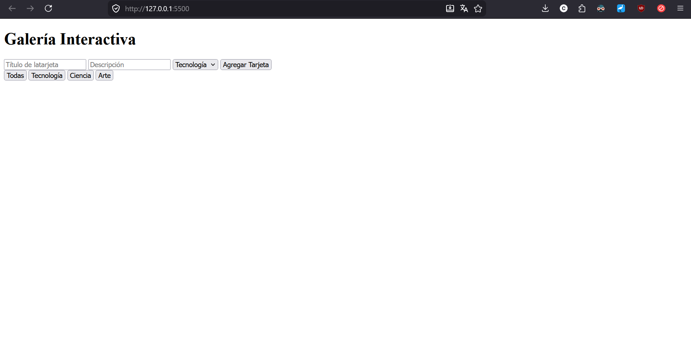
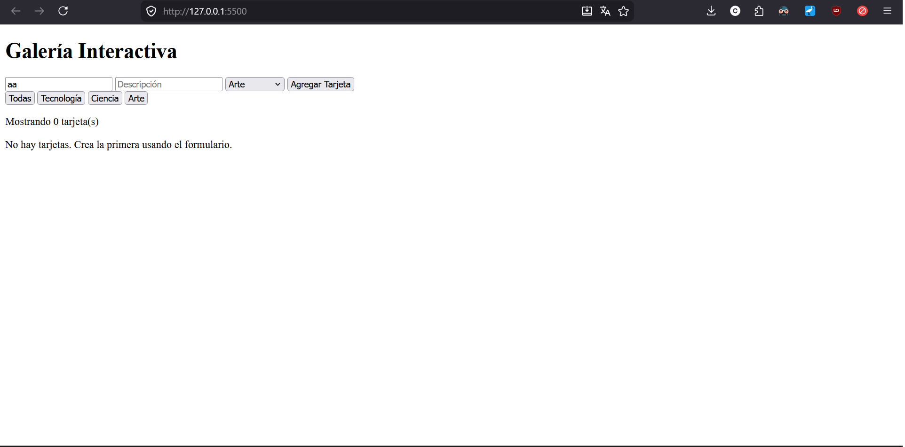
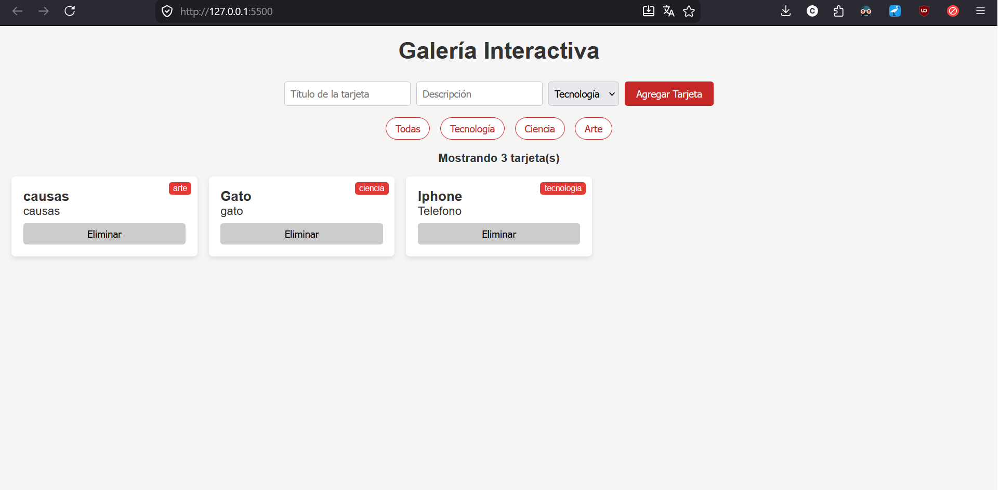
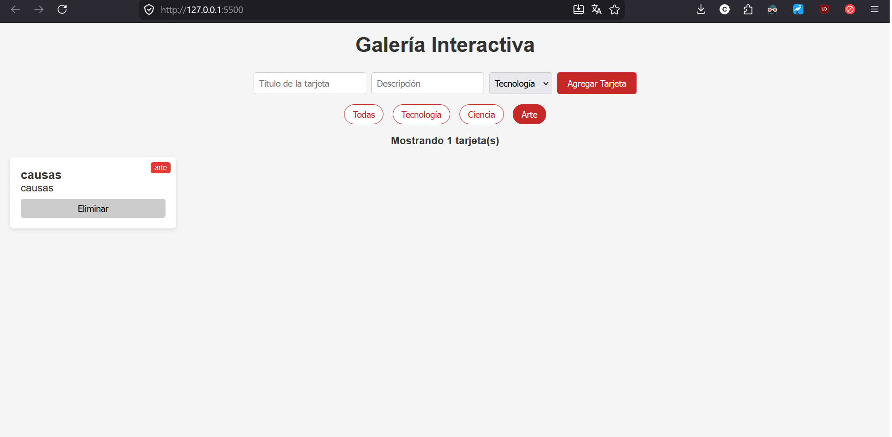
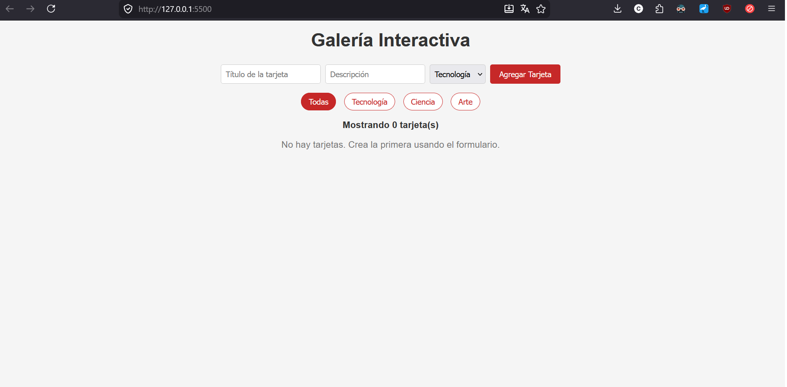

## Andrés Felipe Jiménez Ramírez - 1152219

## Descripción

Este proyecto consiste en una galería interactiva desarrollada con HTML, CSS y JavaScript, que permite crear, visualizar, filtrar y eliminar tarjetas dinámicamente. Cada tarjeta contiene un título, descripción y categoría, y se organiza en un diseño responsive usando CSS Grid. Además, se implementan funcionalidades como filtrado por categoría, contador de tarjetas visibles y un mensaje cuando no hay elementos, con el objetivo de aplicar manipulación del DOM y manejo de eventos en JavaScript.

## Cómo ejecutar

1. Clonar: `git clone https://github.com/OctopusZeroKanagawa/Jimenez-post1-u4.git`
2. Abrir en VS Code → clic derecho en index.html → Open with Live
   Server
3. Navegar a la pagina generada con Live Server

## Capturas de pantalla

